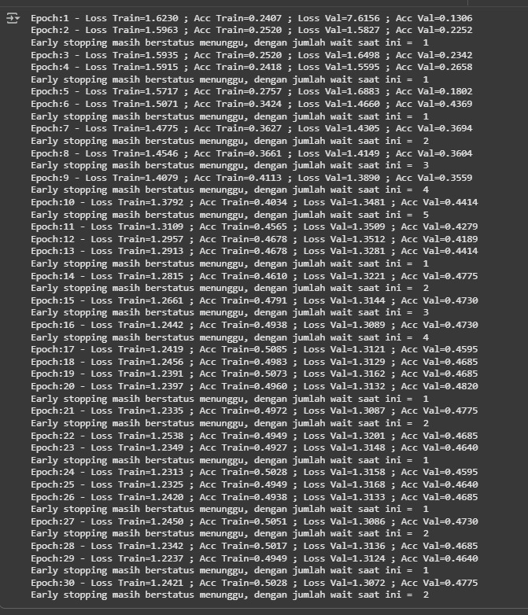
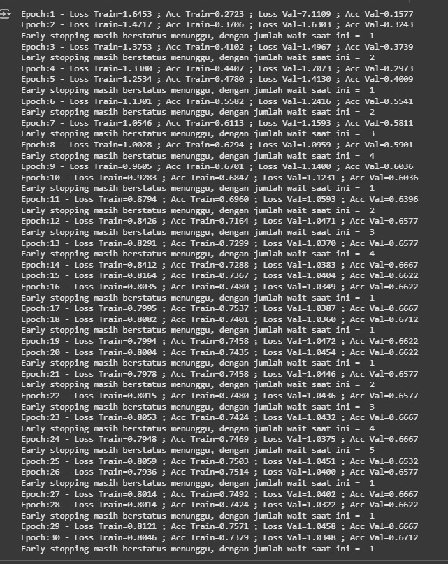
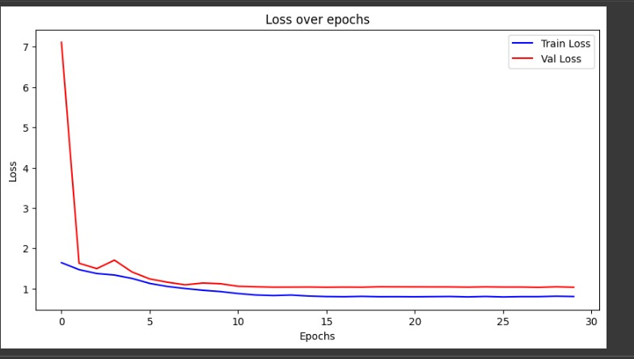
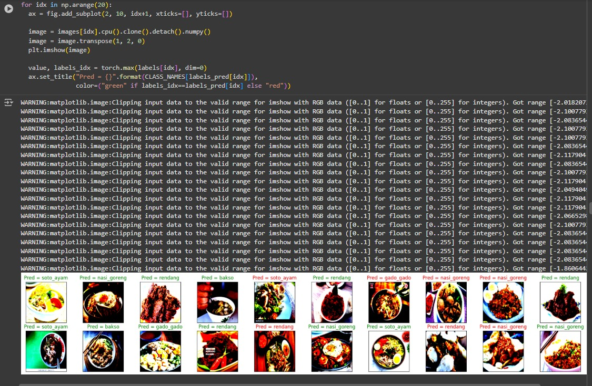
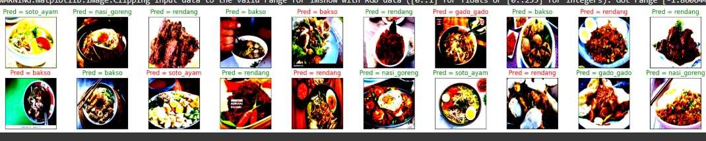
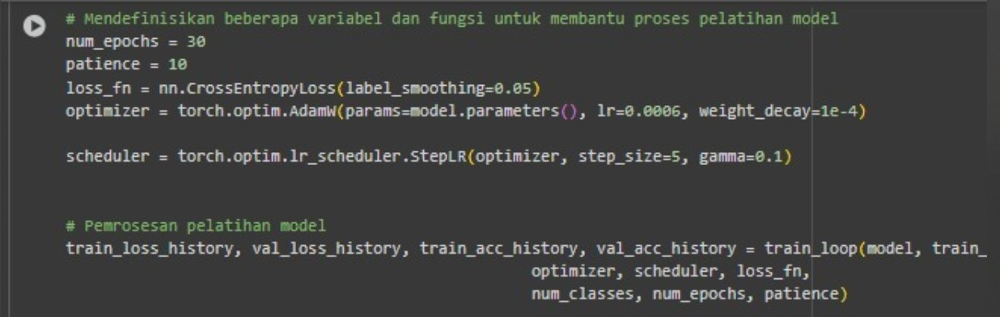

# Submission Tugas Explorasi ResNet
- ## Nama Kelompok : salt
- ## Nama Anggota  :  Mychael Daniel N, Fajrul Ramadhana Aqsa, Ichsan Kuntadi Baskara
- ## Nim Anggota : 122140104, 122140118 ,122140117

## Plain34

### Perbandingan Metrik 

1. Training Accuracy
- Plain-34 : 0,502

2. Validation Accuracy
- Plain-34 : 0,47

3. training loss
- Plain-34 : 1.24

4. validation loss
- Plain-34 : 1,30

## Resnet34

1. Training Accuracy
- Resnet-34 : 0,7379

2. Validation Accuracy
- resnet- 34 : 0,6712

3. training loss
- resnet- 34 : 0,8046

4. validation loss
- resnet- 34 : 1.0348

### Grafik kualitas model

### Plain34

### Resnet34

## Analisis singkat 
### Perbandingan Plain34 vs ResNet34

## 1. Plain34 
- **Pola Loss**: Validation loss awal sangat tinggi, lalu cepat turun dan stabil.  
- **Performa**: Train loss dan validation loss konvergen di nilai rendah setelah beberapa epoch.  
- **Interpretasi**: Mampu belajar dengan baik, ada ketidakstabilan awal, namun tidak ada tanda overfitting parah.  

## 2. ResNet34 
- **Pola Loss**: Tren lebih mulus; train loss konsisten menurun, validation loss ikut turun dengan gap kecil.  
- **Performa**: Kedua loss stabil di nilai rendah dengan generalisasi lebih baik.  
- **Interpretasi**: Lebih efisien, cepat konvergen, dan stabil; residual block efektif mengatasi vanishing gradient.  

## Hasil Pada Test Model Plain34

## Hasil Pada Test Model Resnet34

## Konfigurasi Hyperparamter yang digunakan untuk ketiga eksperimen

- **num_epochs = 30** — jumlah putaran lewat seluruh dataset saat training.
- **patience = 10** — berhenti dini jika 10 epoch berturut-turut tak membaik.
- **label_smoothing = 0.05** — target dihaluskan agar prediksi tak over-confident.
- **learning_rate (lr) = 0.0006** — besar langkah update bobot tiap iterasi.
- **weight_decay = 1e-4** — regularisasi L2 untuk mengurangi overfitting.
- **step_size = 5** — interval epoch untuk menurunkan learning rate (StepLR).
- **gamma = 0.1** — faktor penurun lr tiap `step_size` (lr baru = lr × 0.1).

## link colab 
(https://colab.research.google.com/drive/1Ni0mQ7qrZmD0QmIXqFltyQ3dwOLQXGSr?usp=sharing)

(https://colab.research.google.com/drive/1Ni0mQ7qrZmD0QmIXqFltyQ3dwOLQXGSr?usp=sharing)