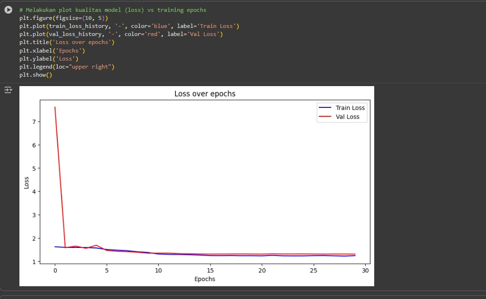

# 🔬 Submission Tugas Explorasi ResNet

### 🔧 **Resnet34-Modified With Integrasi Squeeze-and-Excitation (SE) Block,  Penempatan Dropout/Batch Normalization dan  Mengganti Fungsi Aktivasi**

---

## 👥 **Tim Pengembang**

<table align="center">
<tr>
<td><strong>📋 Nama Kelompok</strong></td>
<td><strong>salt</strong></td>
</tr>
<tr>
<td><strong>👨‍💻 Nama Anggota</strong></td>
<td>Mychael Daniel N, Fajrul Ramadhana Aqsa, Ichsan Kuntadi Baskara</td>
</tr>
<tr>
<td><strong>🎓 Nim Anggota</strong></td>
<td>122140104, 122140118 ,122140117</td>
</tr>
</table>

---

## 🧠 **Plain34**

### 📊 **Perbandingan Metrik**

<table>
<tr>
<th>📈 Metrik</th>
<th>📊 Plain-34</th>
</tr>
<tr>
<td><strong>1. Training Accuracy</strong></td>
<td>0,502</td>
</tr>
<tr>
<td><strong>2. Validation Accuracy</strong></td>
<td>0,47</td>
</tr>
<tr>
<td><strong>3. training loss</strong></td>
<td>1.24</td>
</tr>
<tr>
<td><strong>4. validation loss</strong></td>
<td>1,30</td>
</tr>
</table>

---

## 🚀 **Resnet34**

<table>
<tr>
<th>📈 Metrik</th>
<th>🎯 Resnet-34</th>
</tr>
<tr>
<td><strong>1. Training Accuracy</strong></td>
<td>0,7379</td>
</tr>
<tr>
<td><strong>2. Validation Accuracy</strong></td>
<td>0,6712</td>
</tr>
<tr>
<td><strong>3. training loss</strong></td>
<td>0,8046</td>
</tr>
<tr>
<td><strong>4. validation loss</strong></td>
<td>1.0348</td>
</tr>
</table>

---

## 🔧 **Resnet34-Modified With Integrasi Squeeze-and-Excitation (SE) Block,  Penempatan Dropout/Batch Normalization dan  Mengganti Fungsi Aktivasi**

<table>
<tr>
<th>📈 Metrik</th>
<th>🔧 Resnet-34-Modified</th>
</tr>
<tr>
<td><strong>1. Training Accuracy</strong></td>
<td>0,7028</td>
</tr>
<tr>
<td><strong>2. Validation Accuracy</strong></td>
<td>0,545</td>
</tr>
<tr>
<td><strong>3. training loss</strong></td>
<td>0,8806</td>
</tr>
<tr>
<td><strong>4. validation loss</strong></td>
<td>1.1256</td>
</tr>
</table>

---

## 📊 **Grafik kualitas model**

### 🔵 **Plain34**

### 🟢 **Resnet34**

### � **Resnet34-Modified With Integrasi Squeeze-and-Excitation (SE) Block,  Penempatan Dropout/Batch Normalization dan  Mengganti Fungsi Aktivasi**

---

## 📈 **Analisis singkat**

### 🔍 **Perbandingan Plain34 vs ResNet34**

<strong>📘 1. Plain34</strong>

> - **🔄 Pola Loss**: Validation loss awal sangat tinggi, lalu cepat turun dan stabil.  
> - **⚡ Performa**: Train loss dan validation loss konvergen di nilai rendah setelah beberapa epoch.  
> - **💡 Interpretasi**: Mampu belajar dengan baik, ada ketidakstabilan awal, namun tidak ada tanda overfitting parah.

<strong>🯠2. ResNet34</strong>

> - **📊 Pola Loss**: Tren lebih mulus; train loss konsisten menurun, validation loss ikut turun dengan gap kecil.  
> - **🚀 Performa**: Kedua loss stabil di nilai rendah dengan generalisasi lebih baik.  
> - **✨ Interpretasi**: Lebih efisien, cepat konvergen, dan stabil; residual block efektif mengatasi vanishing gradient.

<strong>🔧 3. ResNet34-Modified With Integrasi Squeeze-and-Excitation (SE) Block,  Penempatan Dropout/Batch Normalization dan  Mengganti Fungsi Aktivasi</strong>

> - **📊 Loss Pattern**: Val loss awal sangat tinggi (~7), turun drastis dan cepat mendekati train loss; setelah ~epoch 10 keduanya stabil rendah.
> - **🚀 Performa**: Hampir tanpa gap besar antara train dan val loss; konsisten sampai akhir 30 epoch.
> - **✨ Interpretasi**: Modifikasi membuat training lebih efisien dan generalisasi semakin kuat; lebih seimbang dan minim overfitting dibanding ResNet34 standar.

---

## 🎯 **Kesimpulan**

<table>
<tr>
<th>🤖 Model</th>
<th>📊 Karakteristik</th>
</tr>
<tr>
<td><strong>🔵 Plain34</strong></td>
<td>Belajar cukup baik, tetapi training lebih lambat dan ada instabilitas awal</td>
</tr>
<tr>
<td><strong>🟢 ResNet34</strong></td>
<td>Lebih stabil dan cepat konvergen; cocok untuk model yang lebih dalam</td>
</tr>
<tr>
<td><strong>🔧 ResNet Modified</strong></td>
<td>Paling unggul sejauh ini: training efisien, loss cepat turun, generalisasi baik, dan stabil sampai akhir</td>
</tr>
</table>

---

## 🧪 **Hasil Testing Model**

### 🔵 **Hasil Pada Test Model Plain34**

### 🟢 **Hasil Pada Test Model Resnet34**

### � **Hasil Pada Test Model Resnet34-Modified With Integrasi Squeeze-and-Excitation (SE) Block,  Penempatan Dropout/Batch Normalization dan  Mengganti Fungsi Aktivasi**

---

## ⚙️ **Konfigurasi Hyperparamter yang digunakan untuk ketiga eksperimen**

<table>
<tr>
<th>🎛️ Parameter</th>
<th>🔧 Value</th>
<th>📝 Description</th>
</tr>
<tr>
<td><code>num_epochs</code></td>
<td><strong>30</strong></td>
<td>jumlah putaran lewat seluruh dataset saat training</td>
</tr>
<tr>
<td><code>patience</code></td>
<td><strong>10</strong></td>
<td>berhenti dini jika 10 epoch berturut-turut tak membaik</td>
</tr>
<tr>
<td><code>label_smoothing</code></td>
<td><strong>0.05</strong></td>
<td>target dihaluskan agar prediksi tak over-confident</td>
</tr>
<tr>
<td><code>learning_rate (lr)</code></td>
<td><strong>0.0006</strong></td>
<td>besar langkah update bobot tiap iterasi</td>
</tr>
<tr>
<td><code>weight_decay</code></td>
<td><strong>1e-4</strong></td>
<td>regularisasi L2 untuk mengurangi overfitting</td>
</tr>
<tr>
<td><code>step_size</code></td>
<td><strong>5</strong></td>
<td>interval epoch untuk menurunkan learning rate (StepLR)</td>
</tr>
<tr>
<td><code>gamma</code></td>
<td><strong>0.1</strong></td>
<td>faktor penurun lr tiap `step_size` (lr baru = lr × 0.1)</td>
</tr>
</table>

---

## 🔗 **link colab**

## https://colab.research.google.com/drive/1Ni0mQ7qrZmD0QmIXqFltyQ3dwOLQXGSr?usp=sharing

---

**🎓 Tugas Deep Learning RB - Semester 7**

*Made with ❤️ by Team Salt*

